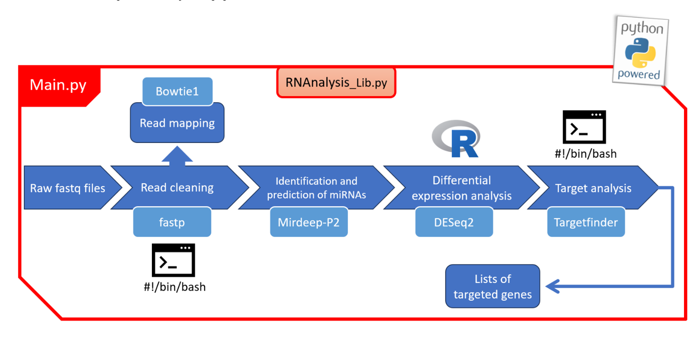

This is an attempt to create a pipeline for the analysis of miRNAs in virus infected plants.
The pipeline is not perfect nor "complete" as is but I plan to upgrade it overtime.

Note : The pipeline is being reworked, the manual is not up to date with the recent changes yet

